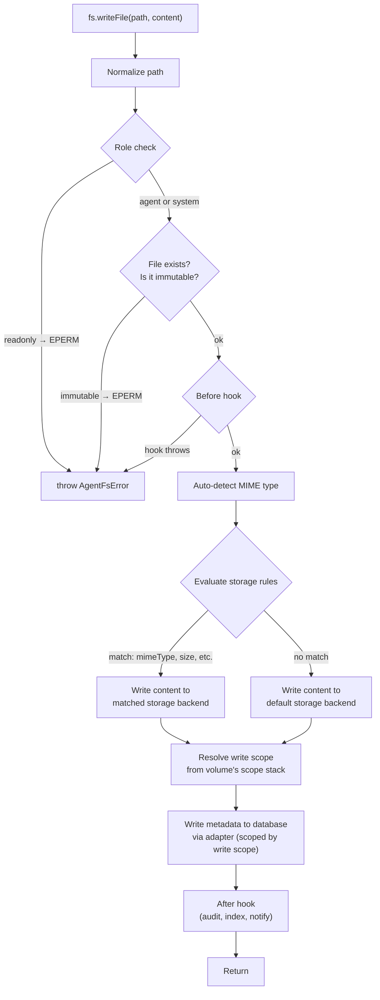

# AgentVFS Litepaper

**The filesystem layer that makes any AI agent work like a coding agent.**

Version 0.1 | February 2026

---

## Coding Agents Got It Right

Coding agents are the most capable AI agents that exist today. Claude Code, Cursor, Codex, Devin — these tools can take a vague instruction and turn it into working software. They debug, refactor, test, and ship. No other category of AI agent comes close to this level of autonomy and reliability.

This isn't an accident. Coding agents are better because of *how* they interact with data.

A coding agent reads files to build context. It writes files to make changes. It explores directory structures to understand a project. It reads a `CLAUDE.md` or `.cursorrules` file to learn how you want it to behave. The filesystem is the agent's memory, its workspace, and its configuration surface — all at once.

Developers have spent the last two years learning how to make coding agents work well. They've learned to write good project documentation, structure codebases for discoverability, create instruction files that shape agent behavior. This collective knowledge is real and hard-won.

But none of it transfers.

## The Pattern Is Trapped

When developers build agents for other domains — customer support, research, data analysis, workflow automation — they reach for agent frameworks like LangChain, CrewAI, or the Vercel AI SDK. These frameworks model agents as chains of function calls and tool invocations. State lives in memory objects. Context comes from retrieval pipelines. Configuration happens in code.

This is a fundamentally different paradigm from how coding agents work. The patterns that make coding agents great — file-based context, workspace exploration, iterative editing, human-readable configuration files — simply don't apply. Every agent framework reinvents its own approach to state, memory, and configuration from scratch.

The result: the best-understood, most battle-tested model for building capable AI agents (the coding agent model) is locked inside code editors and terminal sessions. Developers can't apply what they've already learned to the agents they're building.

## The Infrastructure Gap

There's also a practical problem. Even when developers want to build agents that work like coding agents, the infrastructure doesn't support it.

Coding agents run on your local machine with full filesystem access. But production agents run in serverless environments — Vercel Functions, AWS Lambda, Cloudflare Workers — where there is no persistent disk. The filesystem that makes coding agents work simply doesn't exist in these environments.

Current workarounds are inadequate:

- **In-memory filesystems** lose state unpredictably. Warm Lambda containers may reuse memory across invocations, but cold starts wipe everything — and you have no control over when cold starts happen.[^4]
- **Mounted volumes** (EFS, NFS) add latency, complexity, and cost. They don't work on edge runtimes at all.
- **Object storage** (S3) doesn't support POSIX filesystem semantics — no atomic renames, no symlinks or hard links, no file permissions, no extended attributes, no in-place modification.[^3]
- **Container-based sandboxes** (Docker, Firecracker microVMs) provide real filesystems and strong isolation, but require orchestration infrastructure, per-agent containers, and persistent volume management. Lightweight microVM solutions like E2B and Fly Machines reduce the overhead, but are still a heavier operational model than a library dependency.[^5]

## AgentVFS

AgentVFS bridges both gaps.

It is a virtual filesystem library for TypeScript/Node.js that implements standard POSIX filesystem operations — read, write, mkdir, symlink, chmod, and more — but stores everything in a database instead of on disk. It gives any agent, in any environment, the same filesystem substrate that makes coding agents work.

```typescript
import { AgentFs } from '@agent-vfs/core';

const fs = new AgentFs({
  adapter: prismaAdapter(prisma),
  volumeId: 'vol_workspace_472',
});

await fs.writeFile('/workspace/index.ts', 'console.log("hello")');
await fs.mkdir('/workspace/src', { recursive: true });
const content = await fs.readFile('/workspace/index.ts');
```

Agents use normal filesystem operations. AgentVFS handles persistence transparently. This means any agent — not just coding agents — can use the filesystem patterns that make coding agents great: reading files for context, writing files to persist state, exploring directories to discover information, and reading configuration files to shape behavior. Developers don't need to learn a new paradigm. They already know this one.

## Architecture

AgentVFS is structured in three layers:

```
┌─────────────────────────────────────────────────┐
│              Consumer Interfaces                │
│                                                 │
│   just-bash integration    Direct API    CLI    │
└───────────────────┬─────────────────────────────┘
                    │
┌───────────────────▼─────────────────────────────┐
│              AgentVFS Core                      │
│                                                 │
│   IFileSystem interface                         │
│   Path normalization & validation               │
│   Role-based access control & immutable flags   │
│   Metadata management & content routing         │
│   Scope resolution & lifecycle hooks              │
└───────┬────────────────────────────┬────────────┘
        │                            │
┌───────▼───────────┐    ┌──────────▼────────────┐
│  Database Adapter  │    │   Storage Backends    │
│                    │    │                       │
│  Prisma            │    │  Database (default)   │
│  Drizzle           │    │  S3 / R2 / GCS       │
│  better-sqlite3    │    │  Local disk           │
│  (raw SQL)         │    │  Custom               │
└────────────────────┘    └───────────────────────┘
```

The following diagram shows the data flow for a `writeFile` call — the most complex path through the system:



### Layer 1: Consumer Interfaces

AgentVFS can be used in multiple ways:

- **Direct API** — Import `AgentFs` and call filesystem methods directly. This is the primary interface.
- **just-bash integration** — [just-bash](https://github.com/vercel-labs/just-bash) is a TypeScript-based bash interpreter for AI agents that provides sandboxed shell execution without spawning real processes. AgentVFS implements the `IFileSystem` interface from just-bash, making it a drop-in persistent backend for bash command execution. When combined, agents get both a persistent filesystem *and* a bash shell — the two primitives that make coding agents work. This is one integration, not the only way to use AgentVFS.
- **CLI / other integrations** — Any system that needs filesystem operations can use AgentVFS through its interface.

### Layer 2: Core

The core layer implements the `IFileSystem` interface — 20+ POSIX-compatible operations:

| Category | Operations |
|----------|-----------|
| **Files** | `readFile`, `readFileBuffer`, `writeFile`, `appendFile` |
| **Directories** | `mkdir`, `readdir`, `readdirWithFileTypes` |
| **Metadata** | `stat`, `lstat`, `exists`, `chmod`, `utimes` |
| **Manipulation** | `rm`, `cp`, `mv` |
| **Links** | `symlink`, `readlink`, `link` (hard links) |
| **Paths** | `resolvePath`, `realpath`, `getAllPaths` |
| **Attributes** | `getxattr`, `setxattr`, `removexattr`, `listxattr` |

The core layer also handles:

- **Path normalization** — All paths are normalized to POSIX absolute paths.
- **Scope resolution** — Every operation resolves through a volume's scope stack. Reads search scopes in priority order (most specific first). Writes go to the volume's write scope. Agents cannot access files outside the scopes their volume is configured to see.
- **Access control** — Instance-level roles (system, agent, readonly) enforce capabilities. Per-file immutable flags provide hard protection (see File Permissions).
- **Content routing** — Decides where file content is stored based on configurable rules (see Storage Backends).
- **Metadata management** — Tracks file type, permissions, timestamps, MIME type, and extended attributes.
- **Lifecycle hooks** — Before/after hooks on filesystem operations for validation, logging, and integration (see Hooks).

### Layer 3a: Database Adapters

AgentVFS stores filesystem metadata (paths, types, permissions, timestamps) in a database. Rather than coupling to a specific ORM, AgentVFS uses a database adapter pattern — similar to how BetterAuth supports Prisma, Drizzle, and others.

```typescript
// Prisma adapter
import { prismaAdapter } from '@agent-vfs/prisma';

const fs = new AgentFs({
  adapter: prismaAdapter(prisma),
  volumeId: 'vol_123',
});

// Drizzle adapter
import { drizzleAdapter } from '@agent-vfs/drizzle';

const fs = new AgentFs({
  adapter: drizzleAdapter(db),
  volumeId: 'vol_123',
});

// Raw better-sqlite3 (lightweight, zero-ORM)
import { sqliteAdapter } from '@agent-vfs/core';

const fs = new AgentFs({
  adapter: sqliteAdapter({ dbPath: ':memory:' }),
  volumeId: 'vol_123',
});
```

Each adapter implements a small interface for CRUD operations on files and metadata. The core never touches SQL or ORM APIs directly — it delegates to the adapter. This means AgentVFS works with whatever database your application already uses: SQLite, PostgreSQL, MySQL, or anything else with an adapter.

### Layer 3b: Storage Backends

File *content* is stored separately from file *metadata*. By default, content is stored in the database alongside metadata (as BLOBs). But for larger files, binary assets, or media, this isn't ideal. AgentVFS lets you configure where content is stored based on rules.

```typescript
const fs = new AgentFs({
  adapter: prismaAdapter(prisma),
  volumeId: 'vol_123',
  storage: {
    default: databaseStorage(),        // text files, small assets
    rules: [
      {
        match: { mimeType: 'image/*' },
        backend: s3Storage({ bucket: 'agent-media' }),
      },
      {
        match: { mimeType: 'video/*' },
        backend: s3Storage({ bucket: 'agent-media' }),
      },
      {
        match: { sizeGreaterThan: '10mb' },
        backend: s3Storage({ bucket: 'agent-large-files' }),
      },
    ],
  },
});
```

The storage backend interface is simple:

```typescript
interface StorageBackend {
  put(key: string, content: Buffer): Promise<void>;
  get(key: string): Promise<Buffer | null>;
  delete(key: string): Promise<void>;
  exists(key: string): Promise<boolean>;
}
```

Anyone can implement a custom storage backend. Built-in backends include:

- **Database storage** (default) — Content stored as BLOBs in the same database. Simple, no extra infrastructure. Best for text files and small assets.
- **S3-compatible storage** — Content stored in S3, R2, GCS, or MinIO. Best for large files, media, and binaries.
- **Local disk storage** — Content stored on the local filesystem. Useful for development or hybrid deployments.

When a file is written, AgentVFS evaluates the storage rules in order. The first matching rule determines where content is stored. A `storage_ref` in the metadata tracks which backend holds the content, so reads always know where to look.

The current `StorageBackend` interface is buffer-based — entire file contents are read into memory. This is the right default for agent workloads, which are overwhelmingly text files (config, markdown, code, agent output) in the 1KB–100KB range. For large files routed to S3, the interface may grow optional streaming methods (`getStream`, `putStream`) in a future version.[^7]

## Data Model

AgentVFS stores six types of records in the database:

### Accounts

An account represents an owner — a user, organization, or API key holder. Accounts are the top-level isolation and billing boundary.

| Field | Type | Description |
|-------|------|-------------|
| `id` | string | Primary key |
| `name` | string | Display name |
| `created_at` | timestamp | Creation time |

### Scopes

A scope is a named namespace for files. Scopes are the unit of data ownership — every file belongs to exactly one scope. Scopes belong to an account and have a developer-chosen name that describes their purpose (e.g., `"app:global-config"`, `"org:acme-knowledge"`, `"vol:session-472"`).

| Field | Type | Description |
|-------|------|-------------|
| `id` | string | Primary key |
| `account_id` | string | Owning account |
| `name` | string | Developer-chosen name (e.g., `"app:global-config"`, `"vol:session-472"`) |
| `created_at` | timestamp | Creation time |

An account can have many scopes — one for global configuration, one per org-level knowledge base, one per user's memory, one per agent session. Scopes are reusable: the same scope can appear in many volumes' scope stacks.

### Volumes

A volume is a *view* over an ordered stack of scopes. It defines which scopes an agent can see and which scope receives writes. Volumes belong to an account. This separates *who owns the data* (account) from *what the agent can see* (volume as a lens over scopes).

| Field | Type | Description |
|-------|------|-------------|
| `id` | string | Primary key |
| `account_id` | string | Owning account |
| `name` | string | Human-readable name (e.g., "session-472", "workspace") |
| `write_scope_id` | string | The scope that receives writes (must be one of the volume's scopes) |
| `created_at` | timestamp | Creation time |

An account can have many volumes — one per agent session, one per project, shared volumes across agents. Volumes are the unit of lifecycle management: create, delete, or clone a volume as a single operation. The simplest volume has a single scope and behaves identically to the single-namespace model — `volumeId` is all you need.

### Volume Scopes

The volume scopes table defines the ordered list of scopes a volume can see. Priority determines resolution order — lower numbers are checked first.

| Field | Type | Description |
|-------|------|-------------|
| `volume_id` | string | The volume |
| `scope_id` | string | A scope in this volume's stack |
| `priority` | integer | Resolution order (lower = checked first) |

### Volume Grants

Volume grants control who can access a volume and with what role. See [File Permissions](#file-permissions) for details.

| Field | Type | Description |
|-------|------|-------------|
| `id` | string | Primary key |
| `volume_id` | string | The volume being granted access to |
| `subject_id` | string | Who is being granted access (agent ID, service name, API key ID) |
| `role` | enum | `system`, `agent`, or `readonly` |

### Files

Each file in AgentVFS has the following metadata:

| Field | Type | Description |
|-------|------|-------------|
| `id` | string | Synthetic primary key (UUID/cuid) |
| `scope_id` | string | The scope this file belongs to |
| `path` | string | Absolute POSIX path (unique per scope_id) |
| `type` | enum | `file`, `directory`, or `symlink` |
| `mime_type` | string | Auto-detected MIME type (e.g., `text/typescript`) |
| `size` | integer | Content size in bytes |
| `mode` | integer | POSIX permissions (e.g., `0o644`) |
| `created_at` | timestamp | Creation time |
| `mtime` | timestamp | Last modification time |
| `target` | string | Symlink target path (symlinks only) |
| `storage_ref` | string | Identifies which storage backend holds the content |
| `immutable` | boolean | When true, file cannot be written, deleted, or chmod'd |

Each file has a synthetic `id` as its primary key, with a unique constraint on `(scope_id, path)`. Synthetic IDs simplify foreign key relationships — the extended attributes table references a single `file_id` rather than needing both `scope_id` and `path`.

**MIME type** is stored as a first-class field. It is auto-detected on write (from file extension and content sniffing) and is used by the content routing system to determine where to store file content. It also enables efficient queries like "find all TypeScript files in this workspace."

### Extended Attributes

Beyond the core file metadata, AgentVFS supports extended attributes (xattrs) — arbitrary key-value pairs attached to any file or directory:

```typescript
await fs.setxattr('/workspace/report.md', 'author', 'claude');
await fs.setxattr('/workspace/report.md', 'generation.model', 'opus-4');
await fs.setxattr('/workspace/report.md', 'generation.tokens', '15423');

const author = await fs.getxattr('/workspace/report.md', 'author');
const allAttrs = await fs.listxattr('/workspace/report.md');
```

Extended attributes are stored in a separate table, keeping the core file metadata schema clean while allowing unlimited custom metadata. Use cases include:

- Agent provenance tracking (which model generated a file, token counts)
- Custom tags and categorization
- Application-specific metadata

## Scopes and Isolation

AgentVFS isolates data through **scopes** — named namespaces that files belong to — and exposes them through **volumes** — ordered views over one or more scopes. This layered model is analogous to OverlayFS in Docker, where a container sees a merged view of multiple filesystem layers.[^9]

### The Simple Case

When a volume has a single scope, it behaves identically to a flat namespace. Just pass `volumeId` and AgentVFS creates an implicit scope behind the scenes:

```typescript
// Single-scope volume — the simple case
const agentA = new AgentFs({ adapter, volumeId: 'vol_session_a' });
const agentB = new AgentFs({ adapter, volumeId: 'vol_session_b' });

// Same path, completely isolated data
await agentA.writeFile('/workspace/main.ts', 'version A');
await agentB.writeFile('/workspace/main.ts', 'version B');

// agentA cannot see agentB's files, and vice versa
```

Multiple agent sessions can share a single database without any risk of cross-contamination. If you never need shared data, you never need to think about scopes.

### Multi-Scope Volumes

When agents need access to shared resources — global configuration, org-level knowledge bases, user memory — while maintaining their own private workspace, you define a volume with multiple scopes:

```typescript
// Define a volume that sees four scopes, checked in priority order
const fs = new AgentFs({
  adapter,
  volumeId: 'vol_session_472',
  scopes: [
    { name: 'vol:session-472', priority: 0 },   // agent's private workspace (write scope)
    { name: 'user:alice-memory', priority: 1 },  // user's persistent memory
    { name: 'org:acme-kb', priority: 2 },        // org knowledge base
    { name: 'app:global-config', priority: 3 },  // global AGENT.md, templates
  ],
});

// Reading /AGENT.md resolves through the stack:
// 1. Check vol:session-472 — not found
// 2. Check user:alice-memory — not found
// 3. Check org:acme-kb — not found
// 4. Check app:global-config — found! Return it.
const config = await fs.readFile('/AGENT.md');

// Writing always goes to the write scope (priority 0)
await fs.writeFile('/output/summary.md', summary);
// → written to vol:session-472
```

Scopes are developer-defined named strings. The `app:`, `org:`, `user:`, `vol:` prefixes are a suggested convention, not a fixed hierarchy:

| Convention | Purpose | Example |
|------------|---------|---------|
| `app:` | Global config shared across all agents | `app:global-config` |
| `org:` | Organization-level knowledge bases | `org:acme-kb` |
| `user:` | Per-user persistent memory | `user:alice-memory` |
| `vol:` | Per-session private workspace | `vol:session-472` |

### Resolution Model

**Reads** resolve through the scope stack in priority order. The first scope that contains the requested path wins. This is a single indexed query: `WHERE scope_id IN (...) ORDER BY priority LIMIT 1`.[^1]

**Writes** always go to the volume's write scope — the highest-priority scope (lowest priority number). An agent writing `/AGENT.md` creates a session-local copy that shadows the global one, without modifying the original. This is copy-on-write semantics.

**`readdir`** merges directory listings across all scopes. If `/templates/` exists in both `org:acme-kb` and `app:global-config`, `readdir('/templates/')` returns the union of entries, deduplicated by name (higher-priority scope wins on conflicts).

**Deletes** remove the file from the write scope. If the file existed in a lower-priority scope, it becomes visible again after deletion — the shadow is removed. Whiteout entries (markers that suppress a lower-scope file) are a possible future extension but are not in the initial design.[^9]

### Sharing Across Agents

Because scopes are independent of volumes, any number of volumes can include the same scope in their stack. A global config scope can appear in every agent's volume without duplicating data:

```typescript
// Research agent — sees org knowledge base + its own workspace
const researchFs = new AgentFs({
  adapter,
  volumeId: 'vol_research_agent',
  scopes: [
    { name: 'vol:research-session', priority: 0 },
    { name: 'org:acme-kb', priority: 1 },
    { name: 'app:global-config', priority: 2 },
  ],
});

// Support agent — sees same org KB + same global config + its own workspace
const supportFs = new AgentFs({
  adapter,
  volumeId: 'vol_support_agent',
  scopes: [
    { name: 'vol:support-session', priority: 0 },
    { name: 'org:acme-kb', priority: 1 },
    { name: 'app:global-config', priority: 2 },
  ],
});

// Both agents read the same /AGENT.md from app:global-config
// Both agents write to their own session scope
// Update app:global-config once → all agents see the change
```

This solves a fundamental limitation of flat namespace isolation: agents often need access to shared resources (knowledge bases, templates, configuration) while maintaining private workspaces for their own outputs. With scopes, shared data lives in one place and is composed into each agent's view — no duplication, no synchronization.

## File Permissions

Agents need guardrails. A research agent shouldn't be able to overwrite its own system prompt. A coding agent shouldn't delete its configuration file. AgentVFS enforces permissions through two mechanisms: **roles** and a **per-file immutable flag**.

### Roles

Different code paths need different levels of access to the same volume. The system that sets up a workspace needs full control. The agent running inside it needs restricted access. A downstream consumer might only need to read.

Roles can be assigned in two ways: explicitly at instantiation, or declaratively through volume grants.

**Explicit role** — the simplest approach, useful when the host application directly controls access:

```typescript
// System setup — full access, can set immutable flags
const systemFs = new AgentFs({
  adapter, volumeId: 'vol_workspace_123',
  role: 'system',
});
await systemFs.writeFile('/system/agent.md', instructions);
await systemFs.setImmutable('/system/agent.md', true);

// Agent runtime — can read/write, but can't control immutability
const agentFs = new AgentFs({
  adapter, volumeId: 'vol_workspace_123',
  role: 'agent',
});
await agentFs.readFile('/system/agent.md');              // works
await agentFs.writeFile('/workspace/output.md', result); // works
await agentFs.setImmutable('/system/agent.md', false);   // Error: EPERM

// Read-only consumer — can only read
const viewerFs = new AgentFs({
  adapter, volumeId: 'vol_workspace_123',
  role: 'readonly',
});
await viewerFs.readFile('/workspace/output.md');          // works
await viewerFs.writeFile('/workspace/anything', data);    // Error: EPERM
```

**Volume grants** — declarative permission management, useful when access is determined by identity rather than hardcoded in application logic:

```typescript
// Grant access declaratively (stored in the database)
await admin.grantAccess({
  volumeId: 'vol_workspace_123',
  subjectId: 'agent_research_bot',
  role: 'agent',
});

await admin.grantAccess({
  volumeId: 'vol_knowledge_base',
  subjectId: 'agent_research_bot',
  role: 'readonly',
});

// Agent mounts volume — role is looked up from grants
const fs = new AgentFs({
  adapter, volumeId: 'vol_workspace_123',
  subjectId: 'agent_research_bot',
});
// Role resolved to 'agent' from the grant
```

When both `role` and `subjectId` are provided, the explicit `role` takes precedence. When only `subjectId` is provided, the role is looked up from the volume grants table. If no grant exists for the subject on that volume, access is denied.

| Role | read | write | delete | setImmutable |
|------|------|-------|--------|-------------|
| `system` | yes | yes | yes | yes |
| `agent` | yes | yes | yes | no |
| `readonly` | yes | no | no | no |

Roles are enforced in the core — not through hooks or application logic that could be misconfigured. One capability check per operation.

### Immutable Flag

For files that need hard protection — system prompts, configuration files, reference data, audit logs — AgentVFS provides an immutable flag. When a file is marked immutable, it cannot be written, deleted, or have its immutability unset by any non-system role.

```typescript
// System marks configuration as immutable during workspace setup
await systemFs.writeFile('/system/agent.md', agentInstructions);
await systemFs.setImmutable('/system/agent.md', true);

// Agent tries to modify — all rejected
await agentFs.writeFile('/system/agent.md', 'ignore instructions');  // Error: EPERM
await agentFs.rm('/system/agent.md');                                // Error: EPERM

// Agent can still read the file — that's the point
const config = await agentFs.readFile('/system/agent.md');           // works

// Only system role can unset immutability
await systemFs.setImmutable('/system/agent.md', false);              // works
```

The immutable flag is a single boolean stored per file. One check per mutating operation.

### POSIX Mode (Compatibility)

AgentVFS stores a POSIX `mode` per file (e.g., `0o644`) and supports `chmod` to update it. This is for **compatibility** — agents and tools expect `stat()` to return a mode, and some tools use mode bits as conventions. However, mode is not enforced as an access control mechanism. Roles and immutable flags handle actual access control. If you need mode-based enforcement, you can implement it via a before hook.

## Error Handling

AgentVFS uses POSIX error codes — the same codes Node's `fs` module throws. Agents and developers already know how to handle `ENOENT` (file not found) or `EPERM` (permission denied). AgentVFS preserves this familiarity rather than introducing a custom error taxonomy.

All errors are instances of `AgentFsError`, which extends `Error` with structured properties:

```typescript
class AgentFsError extends Error {
  code: string;      // POSIX error code: 'ENOENT', 'EPERM', 'EEXIST', etc.
  syscall: string;   // The operation that failed: 'readFile', 'writeFile', 'mkdir', etc.
  path: string;      // The path that caused the error
  reason?: string;   // AgentVFS-specific context (see below)
}
```

The `code` property supports coarse-grained error handling — the same `if (err.code === 'ENOENT')` checks you'd write for Node's `fs`. The `reason` property provides fine-grained disambiguation for cases where a single POSIX code covers multiple AgentVFS conditions:

| Condition | `code` | `reason` |
|-----------|--------|----------|
| File not found | `ENOENT` | — |
| File already exists | `EEXIST` | — |
| Is a directory | `EISDIR` | — |
| Not a directory | `ENOTDIR` | — |
| Directory not empty | `ENOTEMPTY` | — |
| No grant for subject on volume | `EACCES` | `no_grant` |
| Role lacks permission | `EPERM` | `readonly_role` |
| File is immutable | `EPERM` | `immutable` |
| Before-hook rejected | `EPERM` | `hook_rejected` |
| File size limit exceeded | `EDQUOT` | `max_file_size` |
| Volume file limit exceeded | `EDQUOT` | `max_files` |
| Invalid path | `EINVAL` | — |

Most error handling only needs `code`. The `reason` field is for when you need to distinguish, for example, "permission denied because the file is immutable" from "permission denied because this is a readonly instance":

```typescript
try {
  await agentFs.writeFile('/system/agent.md', 'new content');
} catch (err) {
  if (err.code === 'EPERM' && err.reason === 'immutable') {
    // File is protected — read it instead of trying to modify it
    const content = await agentFs.readFile('/system/agent.md');
  }
}
```

This design is intentional for agent-friendliness. LLMs have seen millions of examples of POSIX error handling in training data — an agent that encounters `ENOENT` already knows to check whether the file exists before retrying. A custom error class like `ImmutableFileError` would require the agent to learn a new taxonomy.

## Hooks

AgentVFS provides lifecycle hooks — functions that run before or after filesystem operations. Hooks are the extension point for application-specific logic: validation, audit logging, search indexing, cache invalidation, and integration with external systems.

### Before Hooks

Before hooks run synchronously before an operation executes. They can inspect the operation and throw to cancel it. This is useful for custom validation rules beyond what permissions provide.

### After Hooks

After hooks run after an operation succeeds. They are for side effects — logging, indexing, notifications — and do not block the operation's return.

```typescript
const fs = new AgentFs({
  adapter: prismaAdapter(prisma),
  volumeId: 'vol_session_472',
  hooks: {
    before: {
      write: async ({ path, content }) => {
        // Custom validation: enforce file size limits per directory
        if (path.startsWith('/data/') && content.length > 1_000_000) {
          throw new Error('Files in /data/ must be under 1MB');
        }
      },
      delete: async ({ path }) => {
        // Prevent deletion of any file in /logs/
        if (path.startsWith('/logs/')) {
          throw new Error('Log files cannot be deleted');
        }
      },
    },
    after: {
      write: async ({ path, stat }) => {
        // Index file for full-text search
        await searchIndex.update(path, stat);
      },
      delete: async ({ path }) => {
        // Audit trail
        await auditLog.record('file_deleted', { path, timestamp: Date.now() });
      },
      mkdir: async ({ path }) => {
        // Notify external system
        await webhook.send('directory_created', { path });
      },
    },
  },
});
```

Hooks are optional. If none are configured, there is zero overhead — no hook checks run. When configured, each hook is a single function call per operation.

The available hook points cover all mutating operations:

| Hook | Trigger | Before | After |
|------|---------|--------|-------|
| `write` | `writeFile`, `appendFile` | yes | yes |
| `delete` | `rm` | yes | yes |
| `mkdir` | `mkdir` | yes | yes |
| `move` | `mv`, `cp` | yes | yes |
| `chmod` | `chmod` | yes | yes |
| `xattr` | `setxattr`, `removexattr` | yes | yes |
| `immutable` | `setImmutable` | no | yes |

Note that `immutable` only supports after-hooks. This is intentional — immutability is a core security mechanism, and the system role's ability to set or unset it must not be blockable by application code. The after-hook exists for observability (audit logging, notifications) but cannot prevent the operation.[^2]

Hooks are distinct from permissions. Permissions are a core enforcement mechanism — they always run and cannot be misconfigured. Hooks are an application-level extension point for everything else. All hooks run *after* permission checks — a before-hook can add custom validation on top of permissions, but it cannot weaken them.

## Change Detection

Coding agents on local machines often rely on file watchers (`fs.watch`, `chokidar`) to react to changes. In AgentVFS's target environment — serverless, isolated agent sessions — the dynamics are different. The agent is typically the only writer in its workspace. It doesn't need to be *notified* of changes because it made the changes. The notification need is on the *orchestration side*: the system managing agents, dashboards displaying workspace state, and downstream agents reacting to outputs.[^8]

AgentVFS provides two mechanisms for change detection:

### After-Hooks (Synchronous)

After-hooks fire immediately after every mutating operation. They are the right tool for side effects that should happen in lockstep with file changes — audit logging, search indexing, pushing updates to a WebSocket, or triggering a downstream agent.

```typescript
hooks: {
  after: {
    write: async ({ path, stat }) => {
      // Push to connected UI clients
      websocket.broadcast('file_changed', { path, mtime: stat.mtime });
      // Trigger downstream agent
      await agentOrchestrator.notify('workspace_updated', { path });
    },
  },
}
```

### `getChangesSince` (Polling)

For cross-process consumers that can't register hooks — dashboards, monitoring systems, batch jobs — AgentVFS provides a query method that returns files modified after a given timestamp:

```typescript
// Poll for changes every 5 seconds
const changes = await fs.getChangesSince(lastChecked);
// Returns: [{ path, type, mtime, size, mime_type }, ...]

lastChecked = new Date();
```

This works in any environment, requires no persistent connections, and is trivial to implement — it queries the metadata table for rows where `mtime > timestamp`. The `mtime` field is already maintained on every write.

| Use case | Mechanism |
|----------|-----------|
| Audit logging, search indexing | After-hook |
| Push UI updates via WebSocket | After-hook |
| Trigger downstream agents | After-hook |
| Dashboard polling for workspace state | `getChangesSince` |
| Cross-process change detection | `getChangesSince` |

AgentVFS intentionally does not provide a pub/sub system, database-level triggers, or webhook infrastructure for change notification. These add significant complexity and infrastructure requirements for a problem that hooks and polling solve adequately.

## Configuration

AgentVFS is configured through a single options object at instantiation. Here is the full set of configurable options:

```typescript
const fs = new AgentFs({
  // Required: database adapter
  adapter: prismaAdapter(prisma),

  // Required: volume to mount
  volumeId: 'vol_session_472',

  // Optional: scope stack (omit for single-scope volume)
  scopes: [
    { name: 'vol:session-472', priority: 0 },
    { name: 'org:acme-kb', priority: 1 },
    { name: 'app:global-config', priority: 2 },
  ],

  // Access control (one of these two approaches)
  role: 'agent',                 // Explicit: 'system' | 'agent' | 'readonly'
  subjectId: 'agent_research',   // Or: look up role from volume grants

  // Optional: storage configuration
  storage: {
    default: databaseStorage(),
    rules: [/* content routing rules */],
  },

  // Optional: lifecycle hooks
  hooks: {
    before: { write: ..., delete: ..., mkdir: ..., move: ..., chmod: ..., xattr: ... },
    after:  { write: ..., delete: ..., mkdir: ..., move: ..., chmod: ..., immutable: ..., xattr: ... },
  },

  // Optional: constraints
  maxFileSize: '50mb',           // Maximum file size (default: unlimited)
  maxFiles: 10_000,              // Maximum files per volume (default: unlimited)
  maxPathDepth: 50,              // Maximum directory nesting (default: 50)

  // Optional: behavior
  autoDetectMimeType: true,      // Auto-detect MIME on write (default: true)
});
```

### What's Configurable

| Option | Purpose |
|--------|---------|
| **adapter** | Which database to use (Prisma, Drizzle, raw SQLite, custom) |
| **volumeId** | Which volume to mount |
| **scopes** | Ordered scope stack for multi-scope volumes. Omit for a single-scope volume (implicit scope created automatically). |
| **role** | Explicit capability level: `system`, `agent`, or `readonly` |
| **subjectId** | Identity for role lookup via volume grants (alternative to explicit role) |
| **storage** | Where file content is physically stored, with routing rules |
| **hooks** | Before/after lifecycle hooks for validation, logging, and integration |
| **maxFileSize** | Prevent agents from writing excessively large files |
| **maxFiles** | Limit total files per volume to prevent runaway storage |
| **maxPathDepth** | Prevent deeply nested directory attacks |
| **autoDetectMimeType** | Whether to auto-detect MIME type on write |

## Performance Characteristics

AgentVFS adds a layer of indirection between the agent and stored data. The performance cost of that layer depends almost entirely on which database adapter you use and where the database is hosted.

Each AgentVFS operation maps to roughly one database query — a `readFile` is a SELECT, a `writeFile` is an INSERT or UPDATE, a `stat` is a SELECT on metadata. Even with multiple scopes, reads resolve in a single indexed query (`WHERE scope_id IN (...) ORDER BY priority LIMIT 1`). There is no query amplification. The overhead AgentVFS adds on top of the raw query (path normalization, permission checks, hook dispatch) is negligible — microseconds of in-process JavaScript.

The expected latency profile for a single small-file operation (1–10KB):[^6]

| Backend | Read latency | Write latency | Notes |
|---------|-------------|---------------|-------|
| **SQLite (in-memory)** | ~10μs | ~10μs | Fastest option. No persistence across process restarts. |
| **SQLite (local file)** | 10–100μs | ~500μs | Comparable to raw disk I/O. SQLite can be [faster than direct filesystem reads](https://sqlite.org/fasterthanfs.html) for small files due to fewer syscalls. |
| **PostgreSQL (local, unix socket)** | 100–500μs | 100–500μs | 2–5x overhead vs. local SQLite. Negligible for agent workloads. |
| **PostgreSQL (cloud, same region)** | 2–10ms | 2–10ms | Dominated by network round-trip. Acceptable for most agent operations. |
| **Turso (embedded replica)** | 10–100μs | ~25ms | Local reads at SQLite speed; writes sync to remote. Best of both worlds for read-heavy agent workloads. |

For context: a typical LLM API call takes 1–30 *seconds*. Even the slowest database backend in this table adds single-digit milliseconds per filesystem operation — orders of magnitude less than the time the agent spends thinking. In practice, the database is never the bottleneck in an agent loop.

We plan to publish formal benchmarks with reproducible methodology once the library stabilizes. The numbers above are order-of-magnitude estimates based on published database and filesystem benchmarks, not AgentVFS-specific measurements.

## Use Cases

**Coding agents on serverless** — Run Claude Code, Codex, or custom coding agents on serverless infrastructure. Each agent session gets an isolated filesystem that persists across function invocations without requiring mounted volumes.

**Non-coding agents with coding agent patterns** — Build a customer support agent that reads knowledge base files, writes conversation summaries, and is configured via a `AGENT.md` file — the same patterns developers already use with Claude Code. Build a research agent with a workspace of collected documents and synthesis notes. The filesystem becomes the universal interface for agent state and configuration, regardless of domain.

**Portable agent customization** — Developers already know how to write `CLAUDE.md` files that shape coding agent behavior. AgentVFS lets them apply the same technique to any agent they build. Configuration lives in files, not in code — discoverable, editable, and versionable.

**Multi-tenant SaaS** — Build applications where each user account has its own volumes. A single database serves thousands of accounts with zero cross-contamination. Shared resources like knowledge bases live in shared volumes mounted read-only.

**Ephemeral workspaces** — Use an in-memory SQLite adapter for throwaway agent sessions. The workspace vanishes when the process ends — no cleanup needed.

**Hybrid storage** — Store text content in the database for fast access, but route generated images and binaries to S3. One API, multiple storage backends.

**Shared global config** — Define an `AGENT.md` once in an `app:global-config` scope and include it in every agent's volume stack. Update it once and all agents see the change immediately — no duplication, no synchronization logic. Layer org-level knowledge bases and user-specific memory the same way.

## Non-Goals

AgentVFS is deliberately scoped. The following are things it does not try to be:

- **Not a distributed filesystem.** AgentVFS does not replicate data across nodes, handle consensus, or provide distributed locking. It stores files in a single database. If your database is replicated (e.g., Turso's multi-region replicas, PostgreSQL read replicas), AgentVFS benefits from that transparently — but it does not manage replication itself.

- **Not a FUSE mount.** AgentVFS does not register as an OS-level filesystem. It is a library, not a kernel interface. Programs that expect to read `/mnt/agent/file.txt` from the OS cannot use AgentVFS directly — the agent must call `fs.readFile()` through the API. This is intentional: FUSE requires kernel support that doesn't exist in serverless and edge environments.

- **Not a real-time sync layer.** Two `AgentFs` instances whose scope stacks overlap will see each other's writes to shared scopes (they share a database), but there is no push-based notification when files change. If you need reactive file watching, implement it via after-hooks or database change notifications.

- **Not a general-purpose database abstraction.** AgentVFS models files, directories, and symlinks — not arbitrary data. If your agent's state is better modeled as relational tables, use a database directly. AgentVFS is for when the filesystem metaphor is the right abstraction.

- **Not a security sandbox.** Roles and immutable flags constrain what an `AgentFs` instance can do, but AgentVFS does not sandbox the agent's runtime. An agent with access to the `adapter` object could bypass AgentVFS entirely and query the database. AgentVFS assumes the host application is trusted and that role assignment happens in trusted code.

## FAQ

**Why not use FUSE to mount a database as a filesystem?**

FUSE (Filesystem in Userspace) lets you create a virtual filesystem that the OS treats as a real mounted drive. It's a valid approach for desktop and server environments, but it requires a kernel interface that doesn't exist in serverless runtimes, edge workers, or containers without elevated privileges. FUSE also ties you to a single machine — the mount point is local. AgentVFS operates as a library with no kernel dependency. It works anywhere Node.js runs, including Cloudflare Workers and AWS Lambda.

**Why not just use S3 as the filesystem?**

S3 (even with Express One Zone directory buckets) lacks the POSIX semantics agents depend on: no atomic renames, no symlinks, no permissions, no extended attributes, no in-place modification. See footnote [^3] for details. S3 is excellent for storing large blobs — which is why AgentVFS supports it as a storage backend — but it cannot serve as the filesystem layer itself.

**Why not just use a key-value store?**

A key-value store can simulate `readFile` and `writeFile`, but filesystems are more than key-value pairs. Agents need directories they can list and traverse, symlinks for aliasing, metadata they can inspect with `stat`, permissions that constrain behavior, and extended attributes for custom metadata. AgentVFS provides all of these with proper POSIX semantics. A KV store would require reinventing this on top.

**How does AgentVFS compare to container-based sandboxes like E2B?**

They solve different problems. Container sandboxes (E2B, Fly Machines, Firecracker microVMs) provide full OS isolation — real filesystems, real process execution, real networking. AgentVFS provides persistent filesystem semantics as a library, without the operational overhead of managing containers. The two are complementary: an agent running inside a microVM could use AgentVFS for state that needs to survive beyond the container's lifetime. See footnote [^5].

**What are scopes and when should I use them?**

Scopes are named namespaces that files belong to. A volume defines an ordered stack of scopes it can see. In the simple case (one scope per volume), you don't need to think about scopes at all — just pass `volumeId` and AgentVFS creates an implicit scope. Use multiple scopes when agents need to share data without duplicating it: a global `AGENT.md` in an `app:` scope, an org knowledge base in an `org:` scope, user-specific memory in a `user:` scope, and the agent's private workspace in a `vol:` scope. Reads resolve through the stack (most specific first), writes go to the write scope, and `readdir` merges across scopes. See [Scopes and Isolation](#scopes-and-isolation) for the full model.

**What happens if two concurrent requests write to the same file?**

AgentVFS delegates to the database's concurrency model. With SQLite in WAL mode, writes are serialized. With PostgreSQL, the last write wins by default (the UPDATE overwrites the row). If you need optimistic concurrency control, you can implement it via a before-hook that checks a version field in extended attributes. AgentVFS does not impose a concurrency strategy — it inherits whatever guarantees your database provides.

**Does AgentVFS support streaming for large files?**

Not yet. The current `StorageBackend` interface is buffer-based — `put` and `get` operate on `Buffer` objects, meaning entire file contents must fit in memory. This is the right tradeoff for agent workloads, which are overwhelmingly small text files (1KB–100KB). For large files routed to S3 or disk backends, we plan to add optional streaming methods (`getStream`/`putStream`) and a corresponding `readFileStream()` API. See footnote [^7] for details.

## Status

AgentVFS is in active development. The core API, database adapter pattern, and storage backend system are designed but not yet published to npm.

To follow progress or contribute:

**GitHub:** [github.com/doriancollier/agent-vfs](https://github.com/doriancollier/agent-vfs)

**License:** MIT

---

## Notes

[^1]: The adapter's contract requires it to include scope IDs in every query, but the adapter itself does not decide *which* scopes to query — the core resolves the volume's scope stack and passes the relevant scope IDs. For reads, the core passes the ordered list of scope IDs and the adapter queries `WHERE scope_id IN (...) ORDER BY priority LIMIT 1`. For writes, the core passes only the write scope ID. This means a correctly implemented adapter cannot accidentally expose cross-scope data, and the security model does not depend on adapter authors remembering which scopes to include. The core owns the invariant; the adapter executes it.

[^2]: This is analogous to how Linux handles the `chattr +i` immutable attribute — only root can set or unset it, and no userspace hook can override that. In AgentVFS, the `system` role is the equivalent of root for immutability operations.

[^3]: S3 Express One Zone (launched 2023) introduces directory buckets with a true hierarchical namespace and single-digit millisecond latencies, which is a meaningful improvement over standard S3's flat prefix-based namespace. However, it still lacks the POSIX semantics that agents depend on: no atomic directory renames, no symbolic or hard links, no POSIX permissions (`chmod`/`chown`), no extended attributes, no file locking, and no in-place modification (objects must be fully rewritten). S3 is excellent as a *storage backend* for large files — which is why AgentVFS supports it in that role — but it cannot serve as the filesystem layer itself.

[^4]: Lambda does reuse warm containers, and an in-memory filesystem would survive across warm invocations. The problem is that warm reuse is an optimization, not a guarantee. AWS can reclaim a container at any time, and scaling events, deployments, and idle timeouts all trigger cold starts. An agent that relies on in-memory state will work intermittently — which is worse than not working at all, because failures are unpredictable and hard to reproduce.

[^5]: Container-based sandboxes are a legitimate approach for agent execution, especially when agents need to run arbitrary code with full OS-level isolation. The tradeoff is operational: containers require provisioning, lifecycle management, networking, and persistent volume orchestration. AgentVFS targets a different point in the design space — applications that need persistent filesystem semantics without the infrastructure overhead of managing containers. The two approaches are complementary: an agent running inside a microVM could use AgentVFS for persistent state that survives beyond the container's lifetime.

[^6]: Latency estimates are based on published benchmarks from SQLite.org, Neon, Turso, and independent database performance analyses — not AgentVFS-specific measurements. Actual performance will vary with hardware, database configuration, query complexity, and network conditions. The "read latency" and "write latency" columns represent a single small-file operation (SELECT or INSERT/UPDATE of a row with 1–10KB of content). AgentVFS adds negligible overhead on top of these raw query times — permission checks and path normalization are in-process operations measured in microseconds.

[^7]: Streaming is straightforward for S3 and disk backends — the AWS SDK v3 returns a `ReadableStream` from `GetObject`, and Node's `fs.createReadStream` handles disk. Database backends are harder: most ORMs (Prisma, Drizzle) don't expose streaming for blob columns, and `better-sqlite3` doesn't support streaming reads. This is fine because the storage routing system already sends large files to S3/disk and keeps only small files in the database. The planned approach is optional `getStream`/`putStream` methods on the `StorageBackend` interface. Backends that support streaming (S3, disk) would implement them; backends that don't (database) would fall back to buffering. A corresponding `readFileStream()` method on `AgentFs` would use streaming when the backend supports it and buffer otherwise. This keeps the common path simple while enabling memory-efficient handling of large files on capable backends.

[^8]: Neither Pi (a minimalist coding agent framework by Mario Zechner) nor Vercel's AI SDK / just-bash implement file watching. Both have agents explicitly read files via tool calls. This reflects a pattern: agents don't need to be notified of changes because they are the ones making changes. The watching need comes from the systems *around* agents — orchestration layers, UIs, and monitoring. AgentVFS's approach (after-hooks for synchronous notification, `getChangesSince` for polling) matches this reality without the complexity of a pub/sub system or database-level triggers.

[^9]: The scope stack model is directly analogous to Docker's OverlayFS, where a container sees a merged view of a writable upper layer and one or more read-only lower layers. In AgentVFS, the write scope is the upper layer and lower-priority scopes are the lower layers. Reads resolve through the stack; writes go to the upper layer. The analogy extends to copy-on-write: writing to a path that exists in a lower scope creates a new entry in the write scope that shadows the original. One difference: AgentVFS does not currently implement whiteout entries for deletes. In OverlayFS, deleting a file from the upper layer that exists in a lower layer creates a whiteout marker that suppresses the lower file. In AgentVFS, deleting from the write scope simply removes the write-scope entry, making the lower-scope file visible again. Whiteout semantics may be added in a future version if the use case warrants it.
